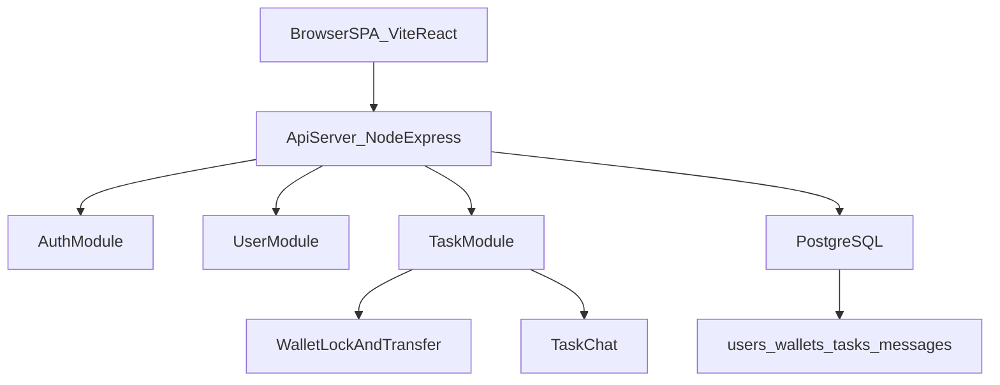

# Task Platform Demo Implementation Plan

## Goals
- Build a demo task platform where users create tasks and other users complete them for money.
- Use a Vite SPA frontend, Node/Express backend, and PostgreSQL database.
- Support login with username/password and salted password hashing.
- Keep KYC simple: every user has `kyc_status`, default `approved` in demo seed data.

## Core Business Rules
- Task owners must lock reward funds from their wallet when creating a task.
- When a task is approved as completed, funds move from owner locked balance to completer available balance.
- Wallet balances must never go negative.
- Task chat is part of the task detail page (details at top, chat below).

## System Structure
- `frontend/`: Vite + React + TypeScript SPA.
- `backend/`: Node + Express API + PostgreSQL access.
- `docker-compose.yml`: local PostgreSQL service.
- `README.md`: setup, run steps, and demo walkthrough.

## Technical Decisions
- **ORM**: Sequelize. Use Sequelize CLI for migrations (JS/TS, not raw SQL).
- **Auth**: JWT.
- **Password hashing**: argon2.
- **Reward amount**: Always USD, always in cents (integer).
- **Task list**: Show all tasks; allow filtering via query param.
- **Task submission**: All steps must be completed before submission; `completed_step_ids` must include every task step ID.
- **Backend tests**: Jest.
- **Input validation**: Zod.
- **Frontend data fetching**: React Query.
- **Frontend styling**: Tailwind.
- **Wallet creation**: Create wallet on user registration. Wallets have `status` (`active` | `inactive`), default `active`.

## Data Model (PostgreSQL)
- `users`
  - `id`, `username` (unique), `password_hash`, `password_salt`, `kyc_status`, `created_at`, `updated_at`
- `wallets`
  - `user_id` (PK/FK), `available_balance`, `locked_balance`, `status` (`active` | `inactive`, default `active`), `updated_at`
- `tasks`
  - `id`, `owner_user_id`, `title`, `description`, `reward_amount` (integer, USD cents), `status` (`open|in_review|completed|cancelled`), `created_at`, `updated_at`, `completed_at`
- `task_steps`
  - `id`, `task_id`, `step_order`, `label`, `created_at`, `updated_at`
- `task_submissions`
  - `id`, `task_id` (unique), `completer_user_id`, `completed_step_ids` (jsonb), `submitted_at`, `approved_at`
- `task_messages`
  - `id`, `task_id`, `author_user_id`, `body`, `created_at`

## API Endpoints
- Auth
  - `POST /auth/register`
  - `POST /auth/login`
  - `GET /auth/me`
- User update
  - `PATCH /users/me` (username and optional password change with new salt+hash)
- Tasks
  - `POST /tasks` (create + lock reward funds)
  - `GET /tasks` (list all; filter by status via query param)
  - `GET /tasks/:id`
  - `PATCH /tasks/:id` (owner only, open tasks only)
    - Update `title`, `description`, `steps`, `reward_amount`
    - Reward increase: lock additional owner funds
    - Reward decrease: release excess locked funds to owner available
  - `DELETE /tasks/:id` (owner only, open tasks only)
    - Soft delete by setting status `cancelled`
    - Release full locked reward back to owner available balance
  - `POST /tasks/:id/submit` (completer must include all step IDs in `completed_step_ids`)
  - `POST /tasks/:id/approve` (owner approves and triggers payout)
- Task chat
  - `GET /tasks/:id/messages`
  - `POST /tasks/:id/messages`

## Transaction and Consistency Rules
- Use DB transactions for:
  - Task creation + wallet lock update
  - Task update when reward changes + wallet rebalance
  - Task delete/cancel + wallet unlock
  - Task approval + payout transfer
- Add guards against double payout:
  - Status checks before approval
  - Submission uniqueness per task

## Frontend Pages
- `Login/Register`
- `Task List`
- `Create Task` (title, description, checkbox steps, reward)
- `Task Detail`
  - Top: title, description, owner, reward, steps, submit/approve actions
  - Bottom: chat message list + composer
- `Profile`
  - Edit current user
  - Show `kyc_status` and wallet balances

## Demo Seed and Walkthrough
- Seed 2-3 users with `kyc_status='approved'` and initial wallet balances.
- Seed at least one task and initial chat messages.
- Demo flow:
  1. Owner logs in and creates task with reward.
  2. Owner updates task details/reward.
  3. Another user submits completion and chats in task.
  4. Owner approves submission and payout is shown in wallet balances.
  5. Owner cancels another open task and locked reward is returned.

## Test Plan
- Backend integration tests:
  - register/login
  - user profile update
  - create task with sufficient/insufficient funds
  - update task reward up/down with correct wallet movement
  - delete/cancel task unlocks funds
  - approve task pays exactly once
  - task chat create/list
- Frontend smoke checks:
  - auth flow
  - task CRUD + chat flow
  - wallet balance updates after each operation

## Deployment Plan
- Backend containerization
  - Add `backend/Dockerfile` using multi-stage build (install deps, build, run production image).
  - Expose API port (default `3000`) and run compiled server entrypoint.
  - Add `backend/.dockerignore` to keep image small.
- Frontend hosting
  - Build static SPA (`npm run build`) and host on Vercel/Netlify/S3+CDN.
  - Configure `VITE_API_URL` to point to deployed backend base URL.
- Database
  - Use managed PostgreSQL for hosted demo environments.
  - Keep Docker PostgreSQL in `docker-compose.yml` for local development only.
- Runtime configuration
  - Backend env vars: `DATABASE_URL`, `JWT_SECRET`, `PORT`, `CORS_ORIGIN`, `NODE_ENV`.
  - Add `.env.example` files for both `backend/` and `frontend/`.
- Release and migration flow
  - On deploy: run migrations first, then start API.
  - Use a release command or entrypoint script to guarantee schema is up to date.
- Optional VPS-style all-in-one demo
  - Add `docker-compose.prod.yml` for `api + postgres + reverse proxy` when cloud services are not used.
  - Include HTTPS notes (Caddy/Nginx + certificate automation) in `README.md`.

## Architecture Diagram

## Initial File Targets
- Backend
  - `backend/src/server.ts`
  - `backend/src/routes/auth.ts`
  - `backend/src/routes/users.ts`
  - `backend/src/routes/tasks.ts`
  - `backend/src/routes/messages.ts`
  - `backend/src/services/walletService.ts`
  - `backend/src/db/migrations/*` (Sequelize CLI)
  - `backend/src/db/seeders/*` (Sequelize seeders)
- Frontend
  - `frontend/src/main.tsx`
  - `frontend/src/App.tsx`
  - `frontend/src/pages/LoginPage.tsx`
  - `frontend/src/pages/TaskListPage.tsx`
  - `frontend/src/pages/CreateTaskPage.tsx`
  - `frontend/src/pages/TaskDetailPage.tsx`
  - `frontend/src/pages/ProfilePage.tsx`
  - `frontend/src/api/client.ts`
- Infra and docs
  - `docker-compose.yml`
  - `README.md`
